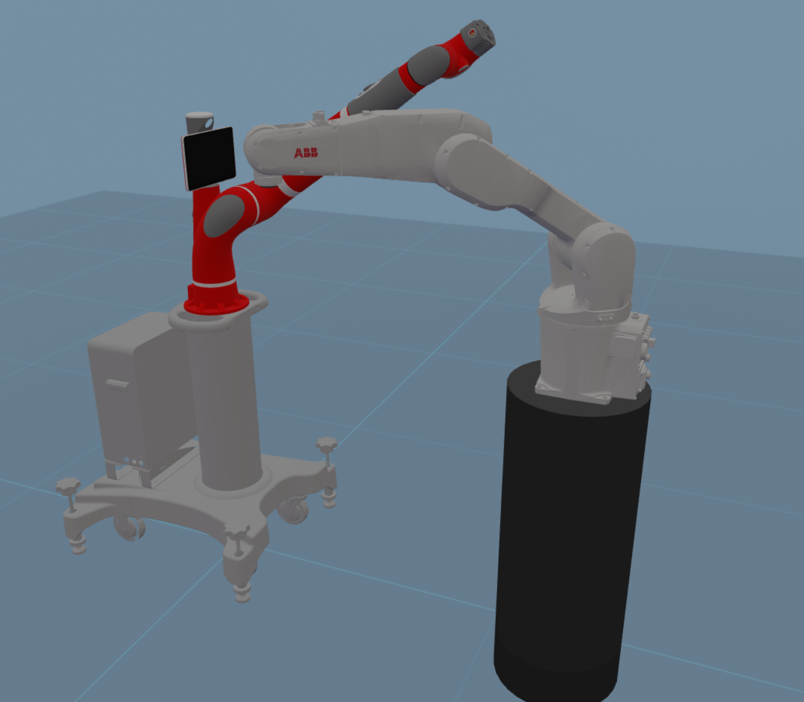
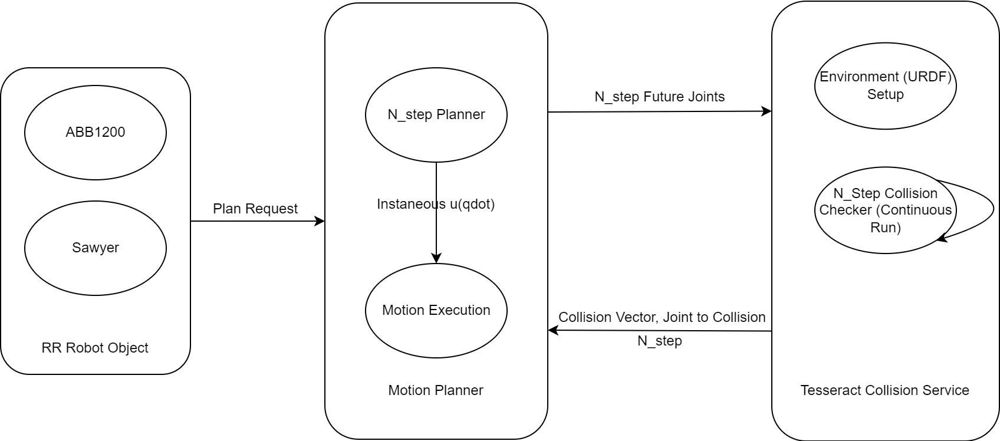

# Instruction
*Tesseract Setup*

*Execution*
Sawyer 20 Steps                 |  ABB 20 Steps
:------------------------------:|:-------------------------:
  | 

*SoftWare Architecture*



## System
Ubuntu (20.04) with ROS noetic
wsl2 on win11 OK

* Simulation robot service (https://drive.google.com/file/d/1lNFGjh11DI32MYN8jgVuNADaLYteue4R/view?usp=sharing & [dotnet3 runtime](https://docs.microsoft.com/en-us/dotnet/core/install/linux-ubuntu))
* Swig 4.0.2 or later

## Binary Packages:
* lcov: sudo apt-get install locv
* ipopt: sudo apt-get install ros-noetic-ipopt
* fcl: sudo apt-get install ros-noetic-fcl
* bullet inverse dynamics float64: sudo apt-get install libbullet-extras-dev
* ompl: sudo apt-get install ros-noetic-ompl
* taskflow: sudo apt-get install ros-noetic-taskflow

## Python Packages
* catkin_tools
* QP: pip install qpsolvers
* General Robotice Toolbox:
* etc.

## ROS Packages (to be built in catkin_ws):
* tesseract (*use wstool*): https://github.com/tesseract-robotics/tesseract_python
* robotraconteur (*noetic branch*): https://github.com/robotraconteur/robotraconteur
* RobotRaconteur_Gazebo_Server_Plugin: https://github.com/johnwason/RobotRaconteur_Gazebo_Server_Plugin
* robotraconteur_companion: 


## workspace build command (using catkin tools):
```
rosdep install --from-paths . --ignore-src --rosdistro noetic -y
catkin build
```

## Path & Source
```
source /opt/ros/noetic/setup.bash
source ~/catkin_ws/devel/setup.bash

export GAZEBO_MODEL_PATH=~/Predictive_planner/models
export GAZEBO_PLUGIN_PATH=~/catkin_ws/devel/lib
```


## Running instructions

`./start_all` to start everything

open separate terminals and run
`python client_same.py`
